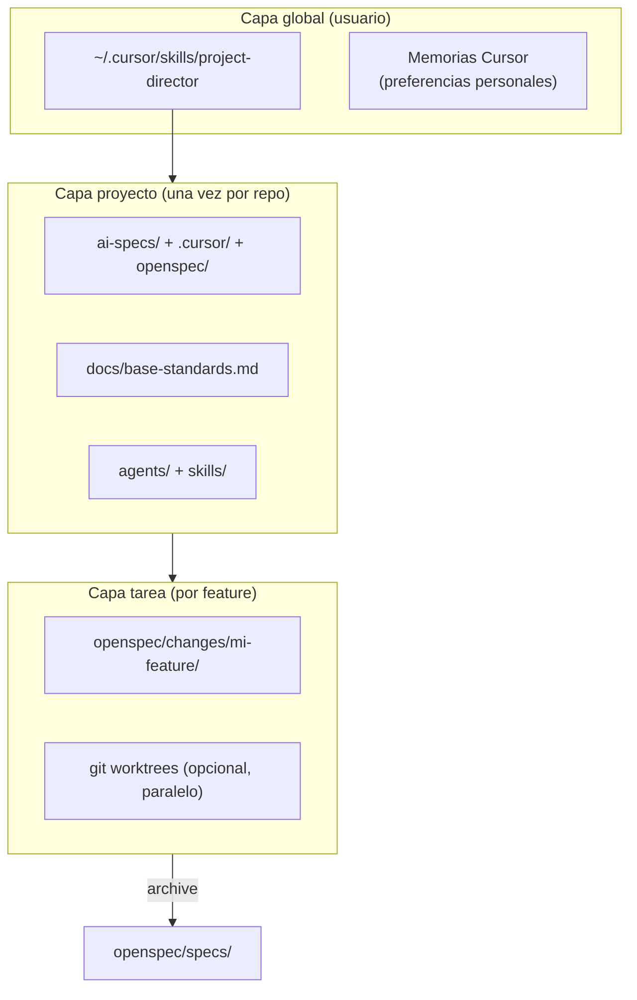
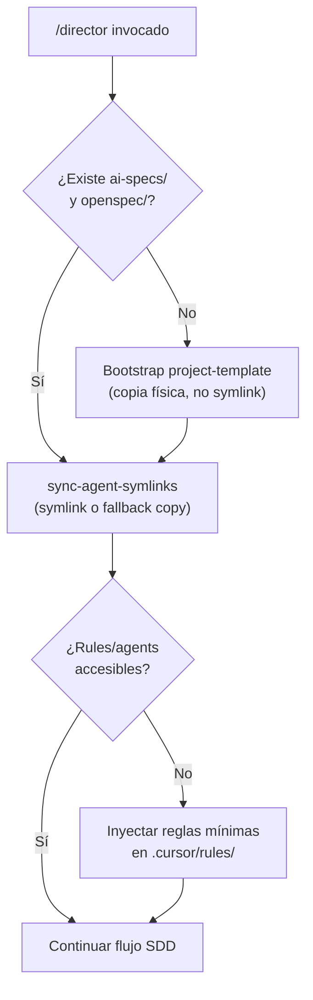

# Cómo incorporar OpenSpec a Cursor

Guía práctica para montar un flujo **Spec-Driven Development (SDD)** con **Context Engineering** y orquestación de agentes en Cursor. Pensada para perfiles que no escriben specs manualmente: el sistema genera contratos; el humano define objetivos, responde preguntas y aprueba en puntos de control.

---

## 1. Objetivo

Incorporar en Cursor un modo de trabajo donde:

- Las **reglas corporativas** viven en archivos de texto que la IA lee siempre.
- La **spec (especificación)** es la fuente de verdad, no el código.
- Un **director de proyecto** orquesta subagentes especializados.
- La **validación** (tests, verify, review) es parte del flujo, no un paso opcional.
- Cada **proyecto nuevo** puede bootstrapearse con la misma plantilla.
- Cada **chat nuevo** reutiliza la configuración del proyecto y crea solo artefactos de la tarea en curso.

---

## 2. Conceptos clave

### 2.1 Context Engineering (organizar la información)

Antes de programar, la IA debe leer las reglas del juego. No se repiten en cada chat como prompts largos: viven en archivos persistentes.


| Qué define                        | Ejemplos en este repo                                                  |
| --------------------------------- | ---------------------------------------------------------------------- |
| Cómo es el sistema (arquitectura) | `README.md`, `docs/backend-standards.md`, `docs/frontend-standards.md` |
| Cómo trabaja el equipo (flujo)    | `docs/base-standards.md`, `openspec/config.yaml`                       |
| Roles de agentes                  | `ai-specs/agents/`                                                     |
| Procedimientos repetibles         | `ai-specs/skills/`                                                     |


**Beneficio:** un perfil junior (o un humano sin experiencia en specs) puede obtener salida con estándar senior porque las decisiones ya están documentadas.

### 2.2 Spec-Driven Development (SDD)

Cambio de paradigma:


| Antes                              | Con SDD                                        |
| ---------------------------------- | ---------------------------------------------- |
| El código es la verdad             | La **spec** es la verdad                       |
| "Mira el código"                   | "Mira el contrato"                             |
| Parche manual si cambia el negocio | **Actualizar spec primero**, luego reconstruir |


Una buena spec incluye:

1. **Objetivo** — por qué existe la feature.
2. **Capacidades / requirements** — qué debe hacer el sistema.
3. **Criterios de aceptación** — escenarios `WHEN` / `THEN` verificables.
4. **Restricciones** — qué NO puede tocar la IA.
5. **Casos de error** — entradas inválidas y respuestas esperadas.

**Regla de oro:** si el contrato cambia a mitad de camino, no se parchea código a mano. Se pausa, se actualiza la spec y la IA reconstruye sobre la nueva regla.

#### 2.2.1 Protocolo anti-"Spec sucia" (código huérfano)

Si la spec cambia **después** de un `/opsx:apply` parcial o completo, volver a ejecutar apply sobre la misma rama mezcla código viejo con reglas nuevas (funciones duplicadas, conflictos Git, "Frankenstein").

**Protocolo obligatorio cuando el contrato cambia mid-flight:**


| Paso | Acción                                                                                                   |
| ---- | -------------------------------------------------------------------------------------------------------- |
| 1    | **Pausar** apply y marcar el cambio como `spec-revised` en el chat                                       |
| 2    | **Actualizar artefactos** (`spec.md`, `design.md`, `tasks.md`) vía `/opsx:continue` o `/opsx:ff` parcial |
| 3    | **Resetear implementación** antes de re-aplicar (elegir una opción)                                      |
| 3a   | **Opción A (recomendada):** nuevo worktree limpio + rama `feature/<change>-v2`                           |
| 3b   | **Opción B:** `git reset --hard` al commit anterior al primer apply de este change                       |
| 3c   | **Opción C:** revertir commits del change y dejar rama limpia                                            |
| 4    | **Invalidar reports** previos en `openspec/changes/<name>/reports/` (mover a `reports/superseded/`)      |
| 5    | **Re-ejecutar** `/opsx:apply` solo tras OK humano del plano revisado                                     |


**Regla:** nunca re-aplicar sobre código generado con una versión anterior de la spec sin limpiar la rama o aislar en worktree nuevo.

### 2.3 OpenSpec — la spec como contrato ejecutable

OpenSpec estandariza el formato del contrato y el ciclo de vida del cambio:

```
proposal → specs → design → tasks → implementación → verify → archive
```

- **proposal.md** — por qué (negocio).
- **spec.md** — qué (requirements + escenarios).
- **design.md** — cómo (arquitectura, archivos).
- **tasks.md** — pasos atómicos verificables.
- **reports/** — prueba de que se cumplió (tests, curl, e2e).
- **archive** — la spec pasa al historial en `openspec/specs/`.

Plantilla de escenario (delta spec):

```markdown
### Requirement: Nombre del requisito
El sistema DEBE [comportamiento en una frase].

#### Scenario: Caso feliz
- **WHEN** [condición]
- **THEN** [resultado exacto]

#### Scenario: Caso de error
- **WHEN** [condición inválida]
- **THEN** [respuesta esperada]
```

---

## 3. Arquitectura: tres capas (global, proyecto, tarea)

Entender estas capas evita confusiones sobre "copias" y memorias.




| Capa                           | ¿Dónde vive?                         | ¿Se crea en cada chat?            |
| ------------------------------ | ------------------------------------ | --------------------------------- |
| Director + skill global        | `~/.cursor/skills/`                  | No — el chat **lee** lo existente |
| Reglas y agentes               | `.cursor/`, `ai-specs/` del proyecto | No — se instala **una vez**       |
| Contrato de la feature         | `openspec/changes/<nombre>/`         | Sí — **por feature**, no por chat |
| Memoria acumulada del proyecto | `openspec/specs/`                    | Crece con cada archive            |


**Aclaración importante:** un chat nuevo con `/director` **no clona** todo `ai-specs/` otra vez. Reutiliza la configuración del proyecto y crea solo la carpeta del cambio en curso.

---

## 4. Estructura del repositorio (referencia)

```
proyecto/
├── ai-specs/                    # Fuente canónica (Context Engineering + orquestación)
│   ├── agents/                  # Subagentes: frontend, backend, director
│   ├── skills/                  # Procedimientos: enrich-us, run-parallel-tasks, review...
│   └── scripts/                 # Automatización auxiliar
├── .cursor/
│   ├── rules/                   # Reglas always-on (apuntan a base-standards)
│   ├── skills/                  # Symlinks → ai-specs/skills/
│   ├── commands/                # Comandos /opsx:* y /director
│   └── agents/                  # Symlinks → ai-specs/agents/
├── openspec/
│   ├── config.yaml              # Reglas del workflow OpenSpec
│   ├── specs/                   # Specs acumuladas (historial vivo)
│   ├── changes/                 # Cambios activos
│   │   └── archive/             # Cambios cerrados
│   └── schemas/                 # Plantillas (lti-sdd, etc.)
├── docs/
│   ├── base-standards.md        # Manual operativo principal
│   ├── backend-standards.md
│   └── frontend-standards.md
├── CLAUDE.md / AGENTS.md        # Punteros al manual
└── backend/ + frontend/         # Código de la aplicación
```

**Principio:** `ai-specs/` es la **fuente canónica**. `.cursor/` y `.claude/` deben referenciarla vía symlinks cuando sea posible (skill `sync-agent-symlinks`).

---

## 5. Mapa: conceptos ↔ archivos en `ai-specs/`


| Concepto              | Rol                   | Ubicación                                                                         |
| --------------------- | --------------------- | --------------------------------------------------------------------------------- |
| Context Engineering   | Reglas permanentes    | `agents/`, skills de infraestructura                                              |
| SDD / contrato        | Spec como verdad      | `project-director` (enrich integrado), `openspec-sync-specs`, `show-spec-working` |
| Pipeline OpenSpec     | Ciclo completo        | `run-parallel-tasks` (encadena opsx)                                              |
| Subagentes            | Roles acotados        | `agents/frontend-developer.md`, `backend-developer.md`                            |
| Orquestación paralela | Worktrees + N agentes | `using-git-worktrees`, `run-parallel-tasks`                                       |
| Validación            | Tests + auditoría     | `adversarial-review`, `code-auditing`, `owasp-security-audit`                     |
| Code review           | Revisor independiente | `adversarial-review` (writer ≠ reviewer)                                          |


### Pipeline codificado en `run-parallel-tasks`

Por cada tarea en paralelo:

```
worktree → enrich-us → opsx:new → opsx:ff → opsx:apply → opsx:verify
         → acceptance-matrix → adversarial-review (sesión nueva) → stop
```

Los comandos `/opsx:*` viven en `.cursor/commands/`; el skill es quien los encadena.

**Importante (§18):** este pipeline en modo **chat asistido** funciona secuencialmente dentro de Cursor. La paralelización real con worktrees + agentes en background **no** la resuelve el chat solo: requiere script de terminal (`ai-specs/scripts/orchestrate.sh`) — ver §18.2.

---

## 6. Ciclo OpenSpec en Cursor (comandos)


| Fase               | Comando                | Qué hace                                                  | Rol humano                             |
| ------------------ | ---------------------- | --------------------------------------------------------- | -------------------------------------- |
| Aclarar idea       | director + `enrich-us` | Convierte idea vaga en user story implementable           | Responder preguntas de negocio         |
| Crear cambio       | `/opsx:new`            | Crea `openspec/changes/<nombre>/`                         | Describir qué quieres                  |
| Generar plano      | `/opsx:ff`             | Genera proposal + specs + design + tasks                  | Revisar y aprobar plano                |
| Ejecutar           | `/opsx:apply`          | Implementa tasks (código + tests)                         | Supervisar                             |
| Verificar mecánica | `/opsx:verify`         | Tasks completas, cobertura vs spec, coherencia con design | Revisar report (no es suficiente solo) |
| Auditar negocio    | `adversarial-review`   | Revisor **independiente** — ver §6.1                      | Decidir qué corregir                   |
| Aceptación humana  | checkpoint explícito   | Demo / criterios de negocio                               | OK final de producto                   |
| Cerrar             | `/opsx:archive`        | Mueve a archive y fusiona specs                           | Confirmar merge                        |


Comando de onboarding guiado: `/opsx:onboard` (recorre el ciclo completo con explicaciones).

### 6.1 Anti-validación circular (crítico)

**Riesgo:** si el mismo agente (o la misma sesión) escribe código **y** tests a partir de la misma spec errónea, `/opsx:verify` puede pasar en verde mientras el producto falla frente al negocio real. Eso es **validación circular**.

**Separación de fuentes de verdad:**


| Capa              | Quién                  | Qué valida                                         | Confía en                                                                      |
| ----------------- | ---------------------- | -------------------------------------------------- | ------------------------------------------------------------------------------ |
| **Mecánica**      | `/opsx:verify`         | Tasks `[x]`, requirements mapeados, design seguido | Spec + código + tests existentes                                               |
| **Adversarial**   | `adversarial-review`   | Romper supuestos, casos negativos, spec drift      | **Solo** `spec.md` + `proposal.md` — **no** confiar en tests del implementador |
| **Independiente** | Matriz de aceptación   | Escenarios de negocio ejecutados aparte            | curl, browser MCP, datos reales/de prueba                                      |
| **Humana**        | Checkpoint de producto | "¿Esto es lo que pedí?"                            | Criterios en lenguaje de negocio                                               |


**Reglas obligatorias:**

1. **Writer ≠ Reviewer ≠ Test author de la matriz independiente** — sesión, agente o modelo distinto para `adversarial-review`.
2. Antes del review, generar `openspec/changes/<name>/reports/acceptance-matrix.md` con escenarios copiados **literalmente** de la spec (WHEN/THEN), sin reinterpretar.
3. El revisor ejecuta la matriz con herramientas externas (curl, browser, DB read-only) — **no** ejecuta solo `npm test` del implementador.
4. Si la spec cambia mid-flight → aplicar protocolo §2.2.1 antes de volver a verificar.
5. `/opsx:verify` en verde **no sustituye** adversarial-review ni OK humano.

**Orden correcto post-implementación:**

```
opsx:apply  →  opsx:verify (mecánico)
           →  acceptance-matrix.md (escenarios literales de spec)
           →  adversarial-review (sesión NUEVA, sin tests del writer como única prueba)
           →  show-spec-working (demo runtime, opcional pero recomendado)
           →  OK humano
           →  opsx:archive
```

---

## 7. Orquestación de agentes

### 7.1 Tres habilidades del humano orquestador

1. **Escribir contratos** (o delegarlos al director) — objetivo, escenarios, criterios de done.
2. **Delegar con claridad** — cada agente recibe solo su slice de la spec.
3. **Respetar el orden** — planificar → ejecutar → verificar → revisar → archivar.

### 7.2 Subagentes y límites

**Decisión de diseño (tokens):** no segmentar estrategia de producto y dirección en dos agentes. El `project-director` **absorbe** el rol de preguntas de negocio (`enrich-us`) y la estructuración del plano. Menos archivos, menos llamadas cruzadas, menos contexto duplicado.


| Agente               | Puede                                                        | No puede                                                      |
| -------------------- | ------------------------------------------------------------ | ------------------------------------------------------------- |
| `project-director`   | Preguntas de negocio, enrich-us, opsx:ff, orquestar, delegar | Escribir código de producción; hacer review de su propio plan |
| `frontend-developer` | Planificar frontend                                          | Implementar (solo propone plan)                               |
| `backend-developer`  | Planificar backend                                           | Tocar UI                                                      |


`product-strategy-analyst` permanece en el repo como referencia legacy para ideación aislada, pero **no forma parte del pipeline `/director`**.

### 7.3 Funcionalidades avanzadas — alineación real con Cursor


| Pieza                 | Para qué sirve                         | Nivel de alineación hoy                             |
| --------------------- | -------------------------------------- | --------------------------------------------------- |
| **Skills**            | Procedimientos corporativos repetibles | 🟢 Perfecto — `ai-specs/skills/`                    |
| **MCPs**              | Terminal, DB, browser, Jira            | 🟢 Perfecto — Cursor los expone nativamente         |
| **Debug + review**    | Writer ≠ reviewer                      | 🟢 Perfecto — §6.1 + `adversarial-review`           |
| **Git worktrees**     | Aislamiento por rama/tarea             | 🟡 Chat: secuencial. Paralelo real: §18.2           |
| **Hooks**             | Disparar agentes al guardar spec       | 🟡 **No nativos** en Cursor — emular vía comandos   |
| **Background agents** | Tareas largas sin bloquear chat        | 🟡 Parcial — Cursor Background Agents + scripts CLI |
| **YOLO mode**         | Autonomía total sin checkpoints        | 🟡 **No existe `/yolo`** — emular con flag `--yolo` |


#### 7.3.1 Hooks — emulación (no nativos)

Cursor **no** dispara agentes automáticamente al guardar un archivo. Para acercarse al e-book:

- Usar **Cursor Hooks** (beta) si están habilitados en tu instalación: evento `afterFileEdit` → script que sugiera `/opsx:apply`.
- Alternativa práctica: el director, tras `/opsx:ff`, **pregunta** "¿Lanzo apply ahora?" en lugar de esperar un hook de filesystem.
- Documentar en el equipo: hooks = conveniencia, no requisito del flujo.

#### 7.3.2 YOLO mode — emulación con flag

No hay comando `/yolo` nativo. Emular en `.cursor/commands/opsx-apply.md` o en el skill del director:

```markdown
Si el usuario invoca con `--yolo`:
- Auto-ejecutar terminal (tests, npm install, migraciones) sin pedir confirmación técnica
- Resolver errores de tipado/lint iterativamente
- Commitear al final sin checkpoint intermedio
- MANTENER checkpoint humano de negocio (plano aprobado + demo final)
- PROHIBIDO en producción, datos reales o compliance
```

Modo por defecto (recomendado): checkpoints en plano, post-verify y pre-archive.

### 7.4 Loop de orquestación (modo asistido)

**Regla de oro:** el director de obra **no agarra la pala** — no escribe código de producción.

```
[Auditor encuentra fallas]
       ↓
[Director actualiza tasks.md con fixes como tareas pendientes]
       ↓
[Director invoca subagente programador (/opsx:apply)]
       ↓
[Programador arregla archivos]
       ↓
[Director lanza subagente adversarial automáticamente — sin preguntar al humano]
       ↓
[Re-audit → repetir si hay Major/Blocker]
       ↓
[OK humano → archive]
```

---

## 8. Agente Director de Proyecto (solución propuesta)

### 8.1 Problema que resuelve

Hoy el sistema asume que sabes qué comando invocar (`/opsx:ff`, `enrich-us`, etc.). El director es la **capa de abstracción** para quien no domina la creación de specs.

### 8.2 Comportamiento

```
/director Quiero que el reclutador filtre candidatos por posición
    ↓
[Fase 0] Bootstrap si falta ai-specs/ (§8.5 — obligatorio antes de todo)
    ↓
Director hace preguntas de negocio (enrich-us integrado)
    ↓
Genera plano (opsx:ff) — proposal, spec, design, tasks
    ↓
Muestra resumen → humano aprueba
    ↓
Delega backend + frontend (subagentes secuenciales en chat, o §18.2 si paralelo)
    ↓
opsx:verify → acceptance-matrix → adversarial-review (subagente automático)
    ↓
OK humano → opsx:archive
```

Si la spec cambia mid-flight → protocolo §2.2.1 (reset/worktree) antes de re-aplicar.

### 8.3 Piezas a implementar


| Pieza                         | Ubicación                            | Alcance                                      |
| ----------------------------- | ------------------------------------ | -------------------------------------------- |
| Skill `project-director`      | `~/.cursor/skills/project-director/` | **Global** — viaja a cualquier proyecto      |
| Skill `project-sdd-init`      | Mismo director o skill aparte        | Bootstrap si falta `ai-specs/`               |
| Agente `project-director.md`  | `ai-specs/agents/`                   | Por proyecto (symlink en `.cursor/agents/`)  |
| Comando `/director`           | `.cursor/commands/director.md`       | Por proyecto (o documentado en skill global) |
| Regla `sdd-orchestration.mdc` | `.cursor/rules/`                     | Obliga flujo SDD en features nuevas          |
| Plantilla                     | `project-template/`                  | Copiar al crear repos nuevos                 |
| Script orquestador            | `ai-specs/scripts/orchestrate.sh`    | Paralelismo real vía terminal (§18.2)        |


### 8.4 Patrón ya existente en tu máquina

El skill global `~/.cursor/skills/design-director/` ya orquesta diseño leyendo `DESIGN.md` del proyecto y delegando a otros skills. El `project-director` para SDD debe seguir el **mismo patrón**.

### 8.5 Orden hiperestricto: director global vs Context Engineering del proyecto

**Trampa a evitar:** el director vive en `~/.cursor/skills/` (global) pero las reglas corporativas viven en `ai-specs/` del proyecto. Si el proyecto no está bootstrapped, `/director` queda "sordo".

**Regla:** el skill global **nunca asume** que el proyecto ya tiene SDD. Siempre ejecuta esta secuencia:




| Prioridad | Fuente de reglas                            | Cuándo                                 |
| --------- | ------------------------------------------- | -------------------------------------- |
| 1         | `docs/base-standards.md` del proyecto       | Tras bootstrap exitoso                 |
| 2         | `ai-specs/` + `.cursor/rules/` del proyecto | Tras sync/copy                         |
| 3         | Reglas mínimas embebidas en el skill global | Solo durante bootstrap o si falla sync |
| 4         | Memorias Cursor del usuario                 | Preferencias, no sustituyen specs      |


El skill global incluye un **subset mínimo embebido** (TDD, spec-first, writer≠reviewer, protocolo spec sucia) para operar aunque el proyecto esté vacío. Tras bootstrap, **deja de usar el subset** y lee solo archivos del repo.

### 8.6 Modo asistido OpenSpec (sin CLI global)

Este proyecto **no requiere** binario `openspec` en PATH. El director opera en modo **asistido**:


| CLI (si existiera)    | Equivalente asistido                                                       |
| --------------------- | -------------------------------------------------------------------------- |
| `openspec new change` | Crear `openspec/changes/<name>/` + `.openspec.yaml` manualmente            |
| `openspec ff`         | Escribir `proposal.md`, `specs/`, `design.md`, `tasks.md` desde plantillas |
| `openspec apply`      | Subagente programador implementa `tasks.md`                                |
| `openspec verify`     | Checklist + acceptance-matrix + adversarial subagent                       |
| `openspec archive`    | Mover a `archive/` y fusionar delta en `openspec/specs/`                   |


### 8.7 Dos modos de operación del director


| Modo                   | Cuándo                   | Cómo                                                              |
| ---------------------- | ------------------------ | ----------------------------------------------------------------- |
| **Asistido** (default) | Features normales, 1 dev | Chat Cursor: director → subagentes vía Task tool, secuencial      |
| **Esteroides**         | N tareas independientes  | `/director parallel ...` → ejecuta `orchestrate.sh` en background |


---

## 9. Memorias: qué es qué


| Tipo                    | Alcance             | Uso                                                  |
| ----------------------- | ------------------- | ---------------------------------------------------- |
| **Memorias Cursor**     | Usuario (global)    | Preferencias: idioma, no commitear sin pedir, etc.   |
| **Context Engineering** | Proyecto (archivos) | `base-standards.md`, `ai-specs/`, reglas `.cursor/`  |
| **OpenSpec archive**    | Proyecto (crece)    | `openspec/specs/` — historial de contratos cumplidos |


**No confundir:** las "memorias corporativas" del e-book son principalmente **archivos en el repo**, más fiables que el recuerdo del chat. Un proyecto nuevo empieza sin historial OpenSpec hasta que se bootstrapea o se archiva la primera feature.

---

## 10. Plan de implementación en fases

### Fase 1 — Mínimo viable (un repo piloto, ej. OpenSpecs) ✅

- Crear `ai-specs/agents/project-director.md`
- Crear `ai-specs/skills/project-director/SKILL.md`
- Crear `.cursor/commands/director.md`
- Crear `.cursor/rules/sdd-orchestration.mdc`
- Symlinks en `.cursor/agents/` y `.cursor/skills/` (+ `.claude/` mirrors)
- Actualizar `docs/base-standards.md` con punto de entrada `/director`
- Plantilla `acceptance-matrix` en `ai-specs/skills/project-director/references/`
- Fallback copy en skill `sync-agent-symlinks` (§13.1)

**Resultado:** `/director` guía el flujo completo en este repo.

### Fase 2 — Director global (cualquier proyecto)

- Instalar `~/.cursor/skills/project-director/` con reglas mínimas embebidas (§8.5)
- Bootstrap obligatorio: si no existe `ai-specs/`, copiar desde `project-template/` (**copia física** en Windows)
- Implementar fallback symlink → copy → inject rules (§13.1)
- Checkpoints humanos: bootstrap → plano → post-review → archive

**Resultado:** abres cualquier carpeta en Cursor; el primer `/director` prepara el proyecto antes de orquestar.

### Fase 3 — Plantilla, automatización y modo esteroides

- Repo o carpeta `project-template/` versionada
- Script o skill `project-sdd-init` para nuevos repos
- `**ai-specs/scripts/orchestrate.sh`** — worktrees + agentes headless en background (§18.2)
- Flag `--yolo` documentado en `opsx-apply` (§7.3.2)
- (Opcional) Cursor Hooks `afterFileEdit` → sugerir apply (§7.3.1)
- (Opcional) Onboarding en español basado en `/opsx:onboard`

---

## 11. Uso diario recomendado

### Proyecto ya bootstrapped

```
1. Abrir proyecto en Cursor
2. Nuevo chat → /director [describe en español lo que quieres]
3. Responder preguntas del director
4. Revisar resumen del plano → "aprobado"
5. Director orquesta implementación + verify + review (subagentes automáticos)
6. Confirmar → archive
```

### Proyecto nuevo (sin SDD)

```
1. Abrir carpeta vacía o repo sin ai-specs
2. /director init   (bootstrap plantilla, una sola vez)
3. /director [primera feature]
```

### Checkpoints humanos recomendados


| Momento                                       | Pregunta                                             |
| --------------------------------------------- | ---------------------------------------------------- |
| Tras bootstrap (proyecto nuevo)               | ¿Se creó `ai-specs/` y las rules son legibles?       |
| Tras `opsx:ff`                                | ¿El plano refleja lo que quiero?                     |
| Tras `opsx:apply` + verify                    | ¿Tasks completas? (mecánico — no suficiente solo)    |
| Tras `acceptance-matrix` + adversarial-review | ¿La demo cumple el negocio real?                     |
| Tras review                                   | ¿Acepto los issues CRITICAL?                         |
| Antes de archive                              | ¿Cierro este cambio?                                 |
| Si la spec cambió mid-flight                  | ¿Se limpió rama/worktree antes de re-apply? (§2.2.1) |


---

## 12. Plantilla mínima de spec (para humanos)

Si escribes una spec a mano (opcional; el director puede generarla):

```markdown
## Por qué
[1-2 frases: problema de negocio]

## Qué cambia
- [cambio 1]
- [cambio 2]

## Restricciones
- No tocar [X]
- Sin cambios de schema / sin nuevas dependencias (si aplica)

## Requisitos

### Requirement: [nombre]
El sistema DEBE [comportamiento].

#### Scenario: [caso feliz]
- **WHEN** [condición]
- **THEN** [resultado]

#### Scenario: [error]
- **WHEN** [condición inválida]
- **THEN** [respuesta]

## Criterios de terminado
- [ ] Tests pasan
- [ ] Escenarios de spec cubiertos
- [ ] Report de verify sin CRITICAL
```

---

## 13. Limitaciones honestas de Cursor


| Expectativa                           | Realidad                                             |
| ------------------------------------- | ---------------------------------------------------- |
| Director siempre activo sin invocarlo | No — se invoca con `/director` o agente director     |
| Clonar ai-specs en cada chat          | No — se lee la config del proyecto                   |
| Subagentes 100% autónomos             | Parcial — checkpoints humanos recomendados           |
| `/opsx:verify` en verde = listo       | No — riesgo de validación circular (§6.1)            |
| Paralelismo real solo con chat        | No — requiere `orchestrate.sh` + agentes CLI (§18.2) |
| Hooks al guardar spec                 | No nativos — emular (§7.3.1)                         |
| Comando `/yolo`                       | No existe — flag `--yolo` en apply (§7.3.2)          |
| OpenSpec CLI global                   | **Opcional** en este proyecto — modo asistido (§8.6) |


### 13.1 Fallback para symlinks en Windows (Plan B obligatorio)

En Windows los symlinks pueden fallar silenciosamente: `/director` no encuentra agents ni skills del proyecto.

**Estrategia en cascada** (implementar en `sync-agent-symlinks` o en bootstrap del director):


| Nivel                  | Acción                                                                                                       | Resultado                                |
| ---------------------- | ------------------------------------------------------------------------------------------------------------ | ---------------------------------------- |
| **1 — Preferido**      | Crear symlinks `.cursor/skills` → `ai-specs/skills`                                                          | Menos duplicación                        |
| **2 — Fallback copy**  | Si symlink falla: **copia física** de `ai-specs/skills/` y `ai-specs/agents/` a `.cursor/`                   | Sistema operativo aunque haya duplicados |
| **3 — Fallback rules** | Si aún falla: escribir snapshot de reglas críticas en `.cursor/rules/sdd-orchestration.mdc` como texto plano | Director no queda sordo                  |
| **4 — Verificación**   | Comprobar que cada skill referenciado es **legible** (Read tool / test de existencia) antes de continuar     | Fail fast con mensaje claro              |


**Regla post-copy:** si se usó copia física, documentar en el chat que el proyecto está en modo `copy-fallback` y que cambios en `ai-specs/` requieren re-sync manual.

---

## 14. Checklist de incorporación

### Por proyecto

- `docs/base-standards.md` existe y está actualizado
- `.cursor/rules/use-base-rules.mdc` apunta a base-standards
- `ai-specs/agents/` y `ai-specs/skills/` poblados
- Symlinks `.cursor/skills` → `ai-specs/skills`
- `openspec/config.yaml` configurado
- Comandos `/opsx:*` en `.cursor/commands/`
- `/director` y agente `project-director`
- Plantilla `acceptance-matrix.md` en reports/
- Procedimiento spec sucia documentado en equipo (§2.2.1)

### Modo esteroides (opcional, §18.2)

- `ai-specs/scripts/orchestrate.sh` probado en Windows
- Agente CLI configurado (Cursor CLI / Claude Code / equivalente)
- Flag `--yolo` documentado si se usa prototipado rápido

### Por usuario (global)

- Skill `project-director` en `~/.cursor/skills/`
- Memorias Cursor con preferencias (idioma, git, etc.)
- Plantilla `project-template/` accesible para bootstrap

---

## 15. Referencias en este repositorio


| Recurso                                | Ruta                                     |
| -------------------------------------- | ---------------------------------------- |
| Manual operativo                       | `docs/base-standards.md`                 |
| Config OpenSpec                        | `openspec/config.yaml`                   |
| Schema SDD                             | `openspec/schemas/lti-sdd/`              |
| Specs vivas                            | `openspec/specs/`                        |
| Cambios archivados (ejemplos)          | `openspec/changes/archive/`              |
| Agentes                                | `ai-specs/agents/`                       |
| Skills                                 | `ai-specs/skills/`                       |
| Comandos Cursor                        | `.cursor/commands/`                      |
| Onboarding interactivo                 | `/opsx:onboard`                          |
| Director                               | `/director`                              |
| Stack Hermes + Cursor + multi-proyecto | `docs/orquestacion-sdd-hermes-cursor.md` |


---

## 16. Resumen ejecutivo

1. **Context Engineering** = reglas en archivos (`base-standards`, `ai-specs`, `.cursor/rules`).
2. **SDD** = la spec es el rey; el código la implementa.
3. **OpenSpec** = formato + ciclo proposal → archive con verify + review independiente.
4. `**ai-specs/`** = cerebro operativo (agentes + skills); no es código de la app.
5. `**/director`** = entrada simple; absorbe enrich-us y estrategia de producto.
6. **Global vs proyecto:** director global bootstrapea primero (§8.5); cada **feature** crea `openspec/changes/<nombre>/`.
7. **Memorias duraderas** = archivos archivados en `openspec/specs/`, no el chat.
8. **Anti-circular** = verify mecánico + matriz independiente + adversarial en subagente + OK humano.
9. **Spec sucia** = reset/worktree obligatorio antes de re-apply si cambia el contrato.
10. **Windows** = symlinks con fallback a copia física e inyección de rules.
11. **Cursor hoy** = chat asistido por defecto; paralelismo real vía scripts CLI (§18).
12. **Hooks / YOLO** = emulados con flags y comandos, no nativos.
13. **Director no codea** = orquesta, actualiza tasks, delega programador y auditor.

> El humano diseña objetivos y aprueba contratos. Los agentes ejecutan, verifican y auditan. La spec conecta negocio con código de forma trazable. **Cursor es el panel de control; la terminal es la flota en modo esteroides.**

---

## 17. Auditoría Agente Bug — vacíos corregidos en este documento


| Hallazgo                                         | Severidad      | Mitigación incorporada                                                                 |
| ------------------------------------------------ | -------------- | -------------------------------------------------------------------------------------- |
| Validación circular en `/opsx:verify`            | Crítico        | §6.1 — matriz de aceptación independiente, adversarial sin confiar en tests del writer |
| Symlinks Windows rompen `/director`              | Crítico        | §13.1 — cascada symlink → copy → inject rules                                          |
| Spec sucia / código huérfano al cambiar contrato | Crítico        | §2.2.1 — reset, worktree nuevo, reports superseded                                     |
| Duplicación director vs product-strategy-analyst | Grasa / tokens | §7.2 — director unificado; analyst fuera del pipeline                                  |
| Inconsistencia global vs proyecto                | Ambigüedad     | §8.5 — orden hiperestricto de bootstrap                                                |


---

## 18. Alineación con Cursor hoy — mapa semáforo (SDD en esteroides)

Respuesta corta: **sí, el plano está alineado conceptualmente**. La limitación no es el diseño de roles ni el flujo OpenSpec, sino **qué puede hacer solo el chat de Cursor** frente a lo que exige orquestación paralela autónoma.

### 18.1 🟢 Perfectamente alineado (10/10)


| Pieza del e-book        | Dónde en el documento                                                |
| ----------------------- | -------------------------------------------------------------------- |
| **Skills**              | §4, §5 — `ai-specs/skills/`, procedimientos repetibles               |
| **MCPs**                | §7.3 — terminal, DB, browser, Jira                                   |
| **Debug + Code Review** | §6.1 — writer ≠ reviewer, `adversarial-review`, matriz independiente |


### 18.2 🔴 Paralelismo autónomo (worktrees + background)

Cursor es un IDE **asistido por chat**. Para paralelismo real, el director dispara `ai-specs/scripts/orchestrate.sh` que crea worktrees y lanza agentes CLI headless.

### 18.3 🟡 Hooks y YOLO

Emulados con flags y comandos del director — no nativos en Cursor.

### 18.4 Veredicto de alineación


| Dimensión                              | Nota                     |
| -------------------------------------- | ------------------------ |
| Context Engineering + OpenSpec + roles | ⭐⭐⭐⭐⭐                    |
| Flujo chat asistido (1 feature)        | ⭐⭐⭐⭐⭐                    |
| Paralelismo autónomo multi-worktree    | ⭐⭐⭐ Requiere scripts CLI |
| Hooks + YOLO nativos                   | ⭐⭐⭐ Emulables            |


---

*Documento restaurado 2026-06-12. Nunca fue commiteado a git; quedó vacío en disco. Versión consolidada de la conversación de diseño SDD + orquestación en Cursor.*